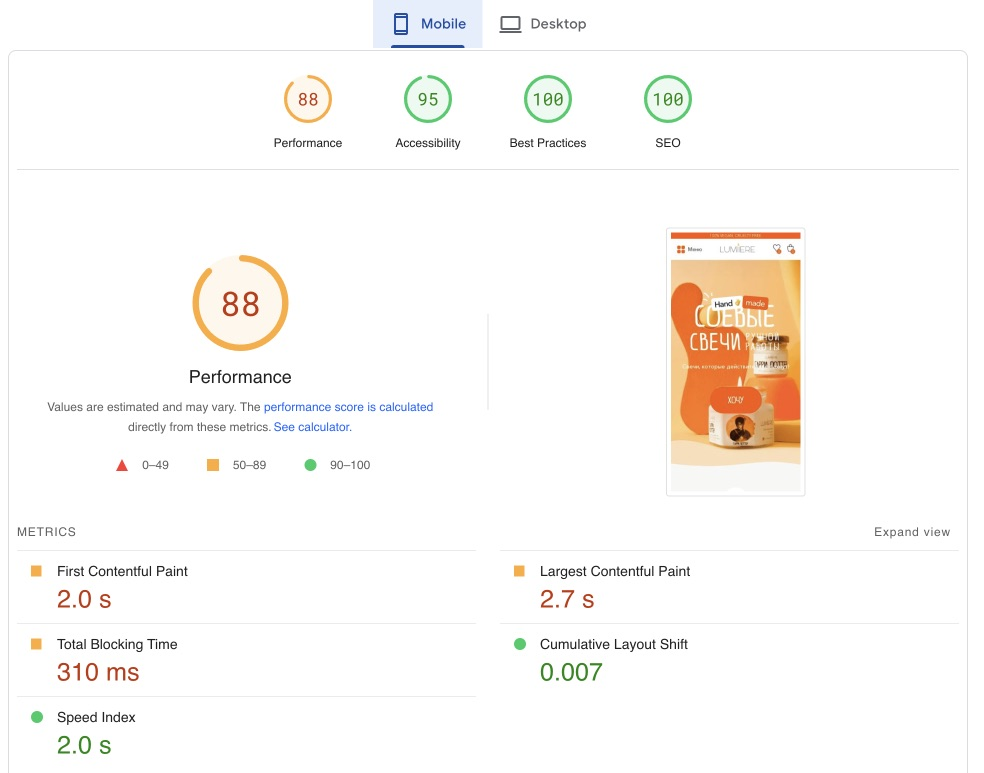
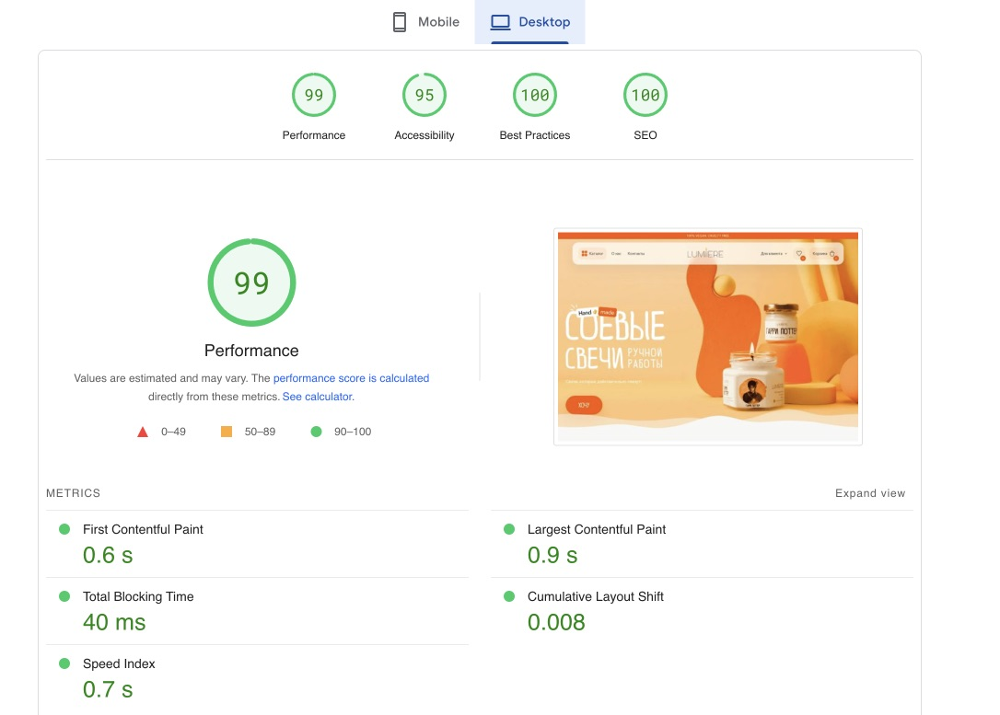
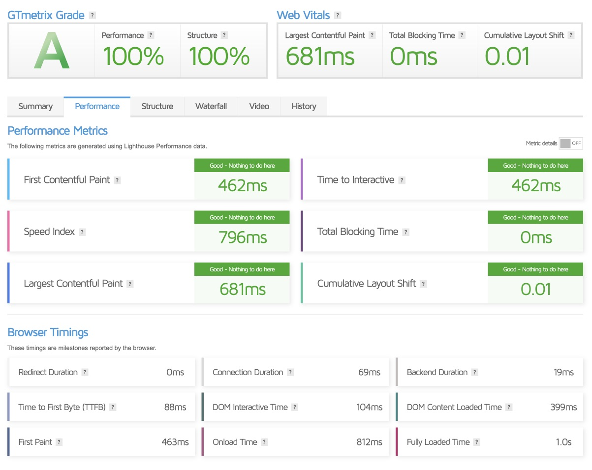
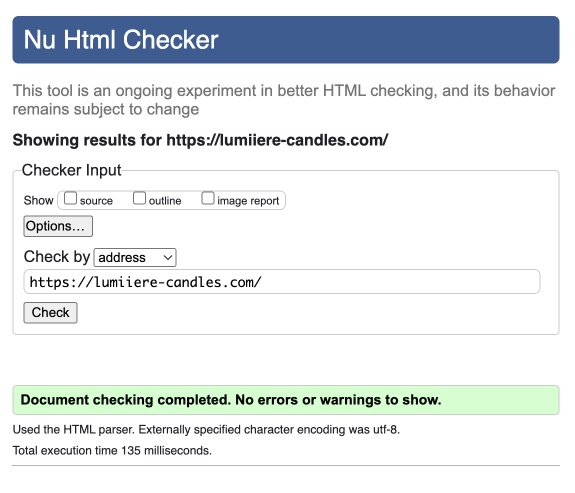

   

      
   

    
   

      
      
      
   

   **Google page speed**

   <table>
      <tr>
         <td>
            
         </td>
         <td>
            
         </td>
      </tr>
   </table>

   <table>
      <tr>
         <td><b>GTMetrix</b></td>
         <td><b>W3W</b></td>
      </tr>
      <tr>
         <td>
            
         </td>
         <td>
            
         </td>
      </tr>
   </table>
