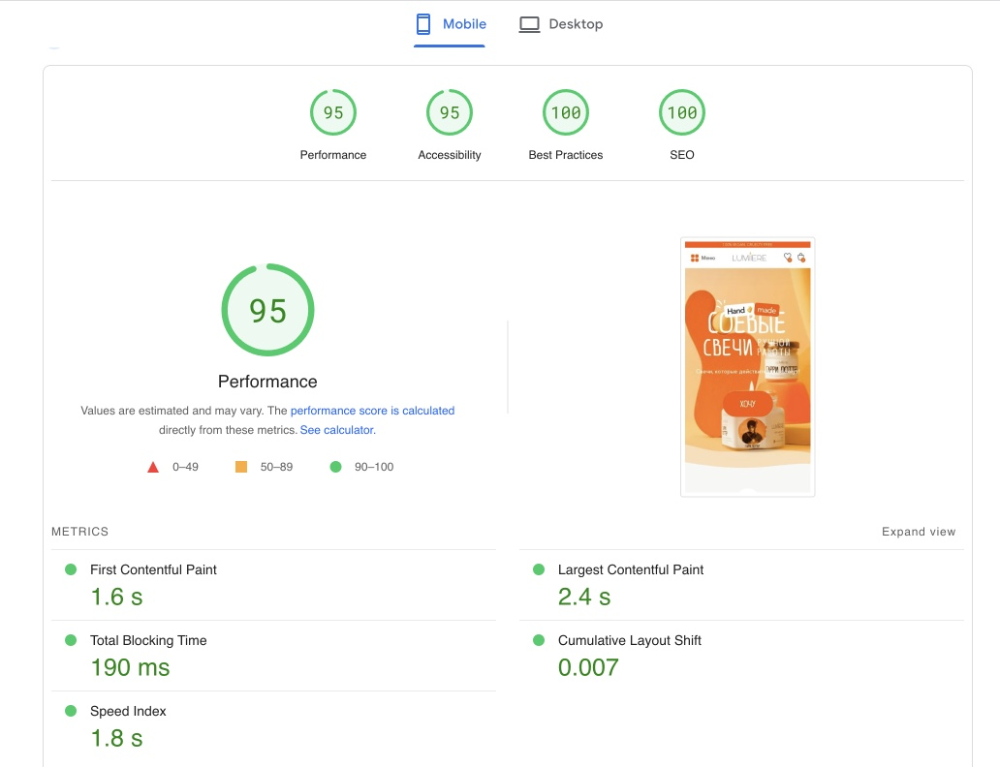
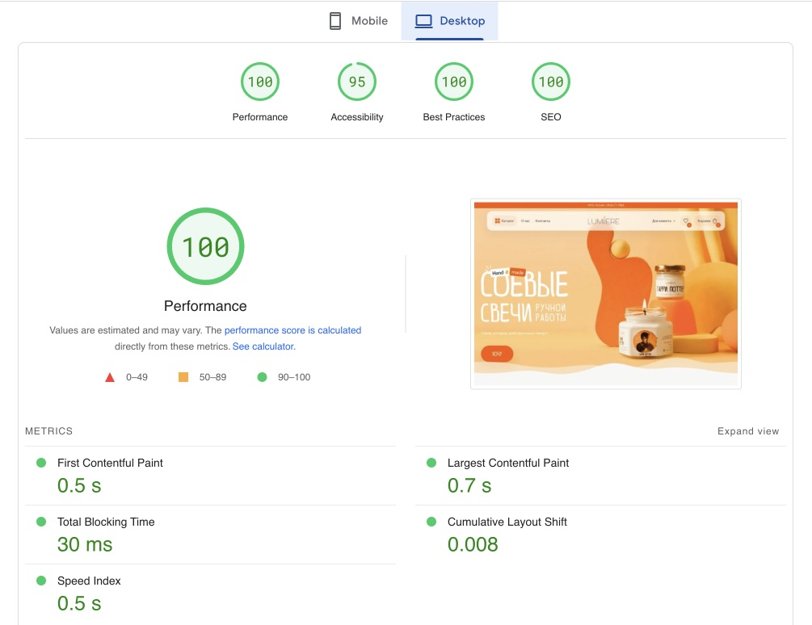
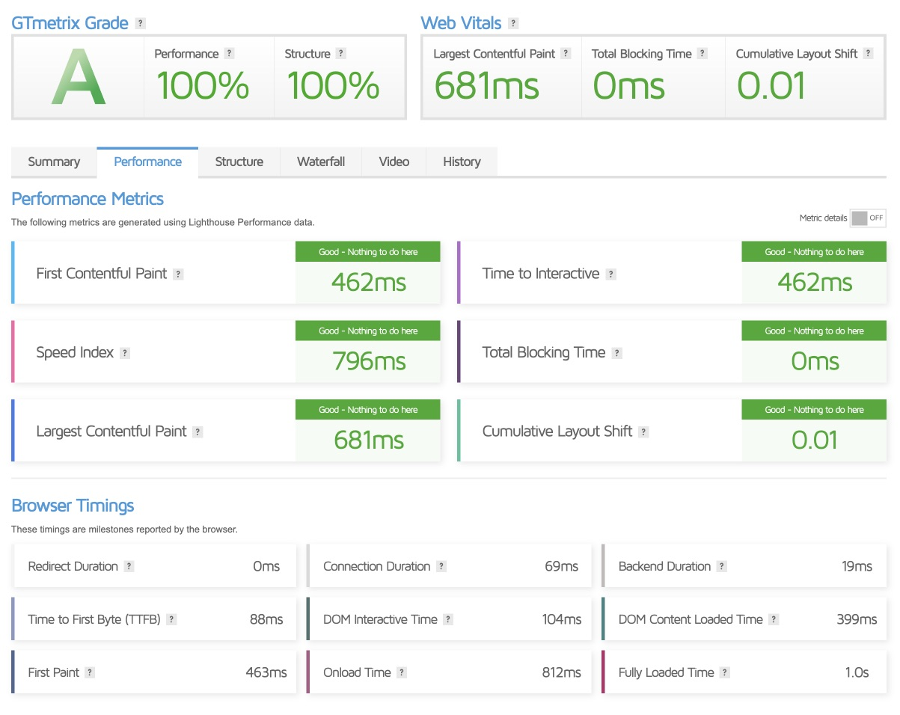
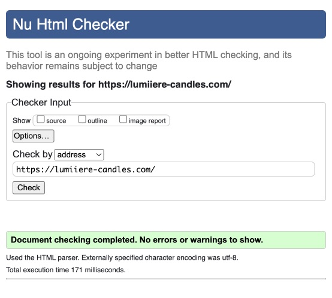

<p align="center">
   <a href="https://vuefire.vuejs.org" target="_blank" rel="noopener noreferrer">
      
   </a>
</p>
<br />
<p align="center">
   <a href="https://github.com/vuejs/vue">
      
   </a>
   <a href="https://github.com/vuejs/pinia">
      
   </a>
   <a href="https://github.com/vuejs/vue">
      
   </a>
</p>

## Access to the admin panel Strapi

```
Url: https://strapi.suchkov.cc/admin
Email: watcher@lumiiere-candles.com
Password: Password12
```

### 💻 Tech Stack:
&nbsp;
&nbsp;
&nbsp;
&nbsp;
&nbsp;
&nbsp;
&nbsp;
&nbsp;
&nbsp;


## Feature

1. Product catalog;
2. Product card;
3. Featured products;
4. Shopping basket;
5. Search for products;
6. Product filter;
7. Product sorting;
8. Catalog pagination;
9. Single page application(SSR);
10. Registration\authorization;
11. LazyLoad img and BlurHash generate;
12. OWASP security and  Cloudflare Turnstile.

## Website speed and performance

<table>
       <tr>
         <td><b>Google Page Speed - mob</b></td>
         <td><b>Google Page Speed - des</b></td>
      </tr>
   <tr>
      <td>
         
      </td>
      <td>
         
      </td>
   </tr>
</table>

   <table>
      <tr>
         <td><b>GTMetrix</b></td>
         <td><b>W3W</b></td>
      </tr>
      <tr>
         <td>
            
         </td>
         <td>
            
         </td>
      </tr>
   </table>
